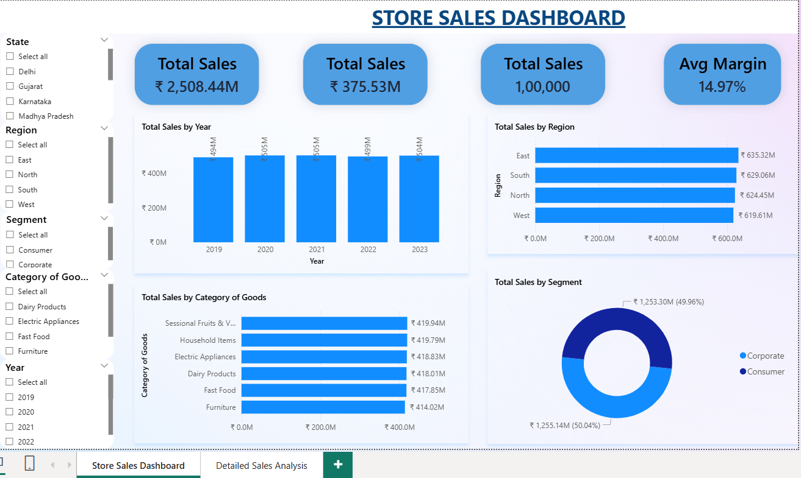
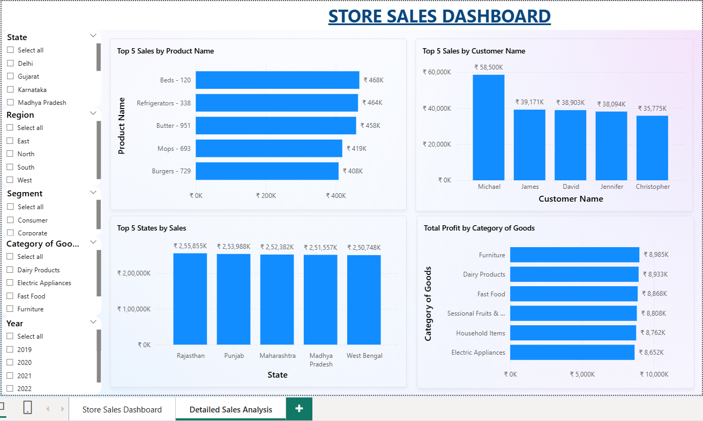

# Store Sales Dashboard | Power BI Business Intelligence Project

An interactive **Power BI dashboard** built to analyze retail sales performance across multiple business dimensions including sales, profit, customers, products, regions, and categories. This project demonstrates an end-to-end data analytics workflow involving **Python, SQL, and Power BI**.

---

## Project Overview

The objective of this project was to transform raw retail sales data into meaningful business insights using Business Intelligence techniques.

The dashboard enables users to:

- Monitor overall business performance
- Analyze yearly sales trends
- Compare regional performance
- Identify top-performing products and customers
- Evaluate product category profitability
- Interactively filter data using slicers

---

# Dashboard Preview

## Executive Dashboard

---

## Detailed Sales Analysis

---

# Dashboard Features

### Executive Dashboard

- Total Sales KPI
- Total Profit KPI
- Total Orders KPI
- Average Margin KPI
- Monthly Sales Trend
- Sales by Region
- Sales by Product Category
- Sales by Customer Segment
- Interactive Filters

---

### Detailed Analysis

- Top 10 Products
- Top Customers
- Sales by State
- Profit by Category

---

# Tools & Technologies

- Python
- SQL
- Microsoft Power BI

---

# Dataset

The dataset contains retail sales transactions from **2019–2023** including:

- Customer Information
- Product Details
- Sales
- Profit
- Region
- State
- Product Category
- Customer Segment
- Order Date

---

# Project Workflow

## 1. Data Cleaning (Excel)

- Removed duplicate records
- Checked missing values
- Standardized column names
- Verified data consistency
- Prepared dataset for analysis

---

## 2. Data Analysis (SQL)

Performed SQL queries to analyze:

- Sales by Region
- Sales by Category
- Customer Analysis
- Product Performance
- Profit Analysis
- Aggregations using GROUP BY
- Sorting and Filtering

---

## 3. Dashboard Development (Power BI)

Created:

- Interactive KPI Cards
- Dynamic Charts
- Slicers
- DAX Measures
- Drill-down Analysis
- Cross-filtering Visuals

---

# Key Business Insights

### Sales Performance

- Sales remained relatively stable throughout the five-year period.
- 2021 recorded the highest overall sales.
- Business maintained consistent revenue without significant fluctuations.

---

### Regional Analysis

- East region generated the highest revenue.
- Revenue distribution remained balanced across all regions.

---

### Product Categories

- Seasonal Fruits & Vegetables generated the highest sales.
- Household Items generated the highest profit.

---

### Customer Segment

- Consumer and Corporate segments contributed almost equally to total revenue.

---

### Top Products

A small number of products contributed a significant portion of total sales, highlighting opportunities for focused inventory planning and promotional campaigns.

---

### Customer Analysis

Top customers generated substantially higher revenue than average customers, making them ideal candidates for customer retention and loyalty programs.

---

# Business Recommendations

- Increase inventory for high-selling products.
- Invest more marketing resources in top-performing regions.
- Introduce loyalty programs for high-value customers.
- Focus on high-margin product categories.
- Continuously monitor yearly sales trends to identify future growth opportunities.

---

# Skills Demonstrated

- Data Cleaning
- Data Analysis
- SQL
- Power BI
- Dashboard Design
- Data Visualization
- KPI Reporting
- Business Intelligence
- Business Analytics

---

# Future Improvements

Potential enhancements for this dashboard include:

- Forecasting future sales trends
- Customer Lifetime Value (CLV) analysis
- RFM Customer Segmentation
- Geographic map visualizations
- Advanced DAX calculations
- Drill-through pages
- Row-Level Security (RLS)

---

# Author

**Shashwat Kumar**

Aspiring Data Analyst

LinkedIn: www.linkedin.com/in/shashwats07

GitHub: www.github.com/shashwat-pvtt

---
